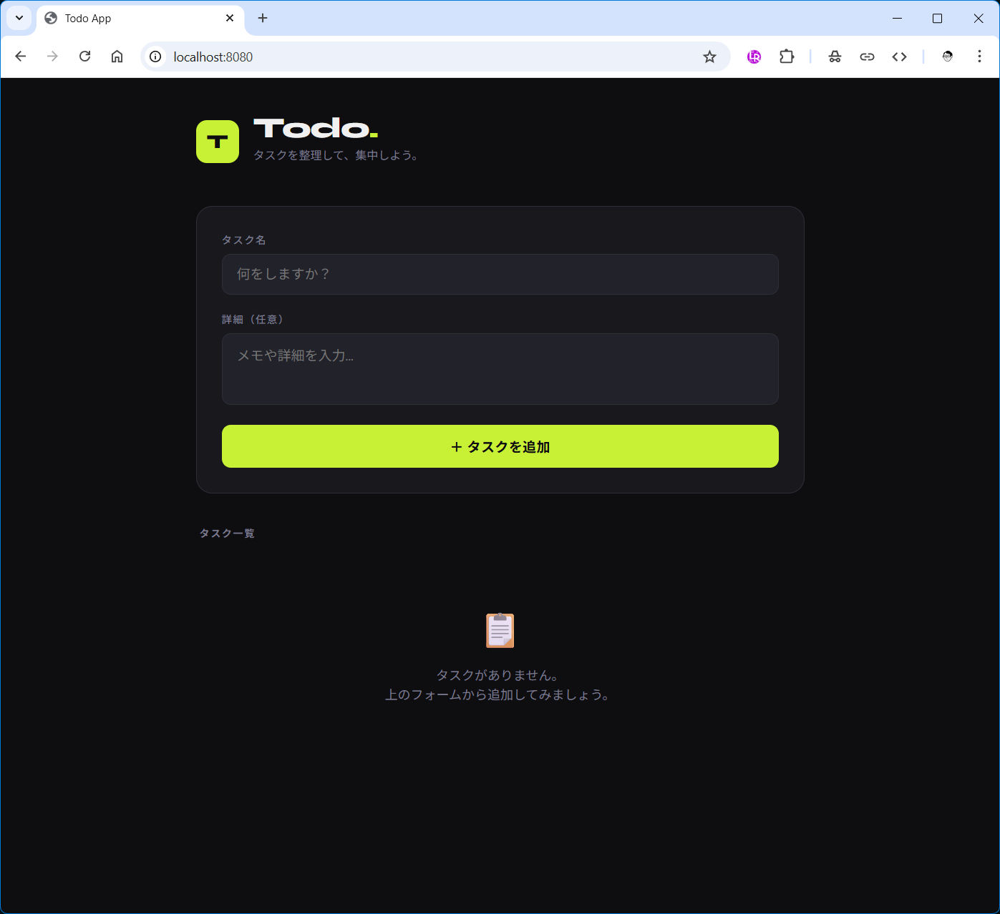
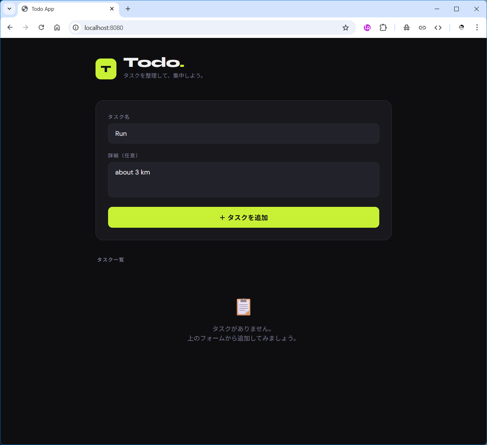
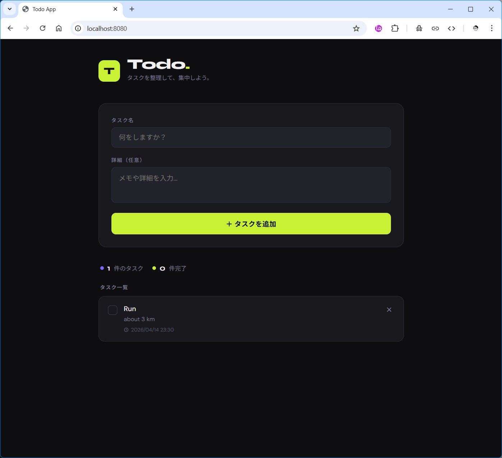
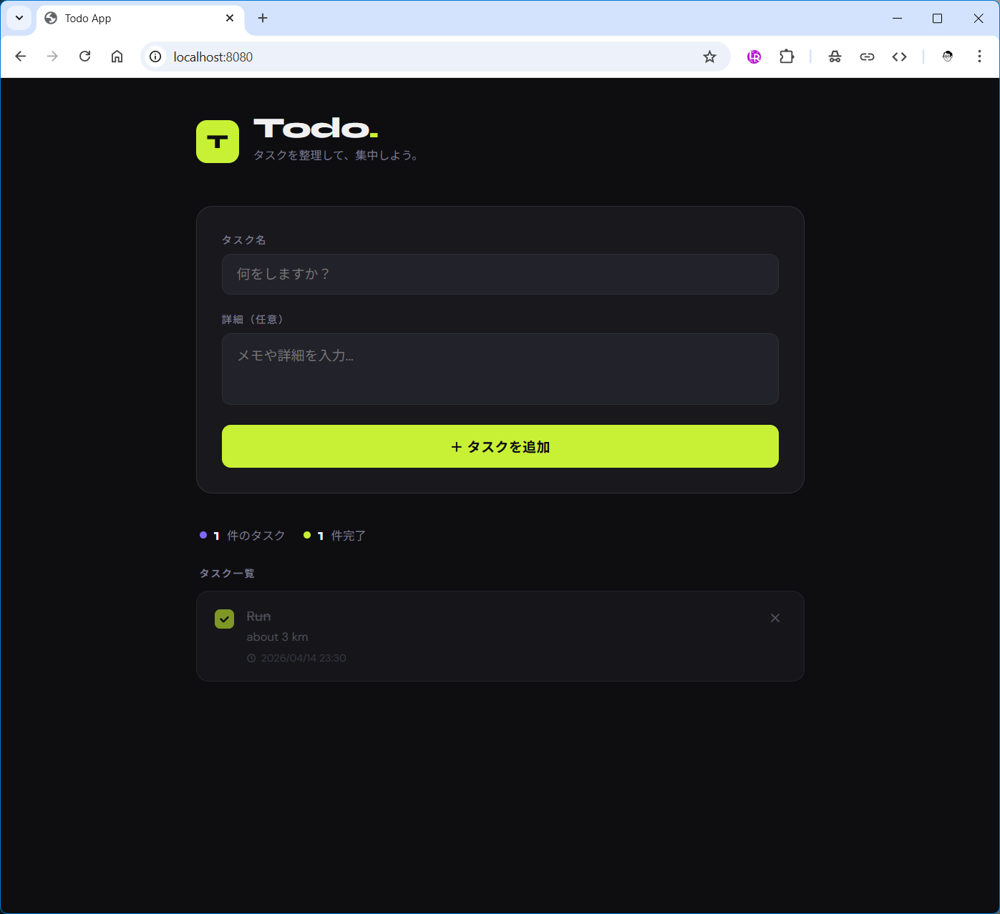

# Project Description

This project is a simple Todo application built with Go. It allows users to manage their tasks efficiently with a clean and intuitive interface. The application includes features such as task creation, editing, and deletion. It is designed to be lightweight and easy to deploy.

# Screen shot

